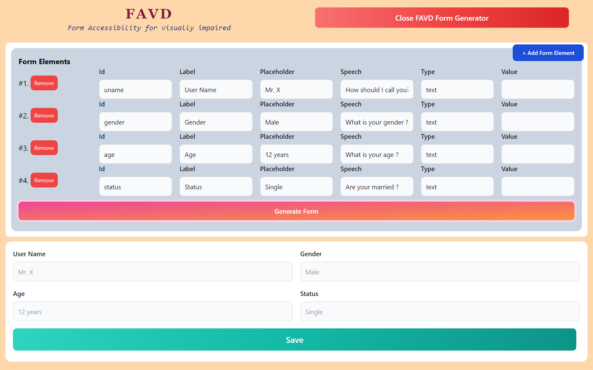
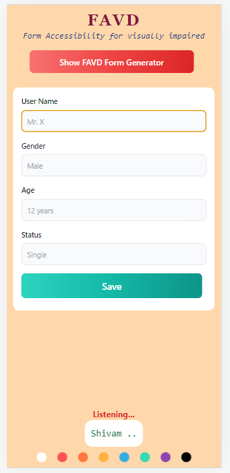

#       **[FAVD](https://62e3b3f958ca717703743a51--incandescent-crisp-e666b1.netlify.app/)**  
## Form Accesibilty for Visually Disabled

### What are favd form ?
>These are normal HTML forms, but can also be used by a blind👨‍🦯person.
>As soon as the focus shift to first input element,System will start asking respective questions and wait for the answer from user in audio format.
>Once the System recognizes the answer it assign that value to that form element and moves the focus to next element and repeats the process of asking question and waiting for answer.

### How do these form work ?
>I am using JS web speech API for converting speech to text and vice-versa.Developer can hard code the speech text for a given input and the form will then take the text and ask question accordingly.
>User then answers the question, system uses audio recognition api to convert the audio to text, which is then saved to form data.

### What is favd form generator ?
>Instead of writing the code for form, user can use this generator and create a form form for their own pages, by giving input field parameters.

### How to use favd form in your angular projects ?
>Simply use [form-creator component](src\app\components\form-creator) in your angular application.
>you have to pass JS object array which defines your form input elements of type [formElement[  ]]().

```
interface formElement {
  label: string;
  type: 'text';
  speech: string;
  id: string;
  value?: string | number;
  placeholder?: string;
}
```

#### Example of the form array which is to be passed to form-creator component.
```
[
    {
      id:'uname',
      label:'Name : ',
      speech:'What should I call you ?',
      type:'text',
      
    },
    {
      id:'gender',
      label:'Gender : ',
      speech:'are you a male or female ?',
      type:'text'
    },
    {
      id:'woc',
      label:'Weapon of Choice : ',
      speech:'What is your weapon of choice : ',
      type:'text'
    },
    {
      id:'age',
      label:'Age :',
      speech:'How long have you been on this planet ?',
      type:'text'
    }

  ]
```


## Technolgy Used

[Angular](https://angular.io/), [Tailwind CSS](https://tailwindcss.com/docs/installation) ,  [Web Speech Api](https://developer.mozilla.org/en-US/docs/Web/API/Web_Speech_API)


  
## Deployment
 To run this project run
 
```bash
 ng serve -o
```


## Screen-Shots

**FAVD Form Generator**        


**Responsive Page Design using tailwind CSS**        



## Developer
[@shivam101gaur](https://www.github.com/shivam101gaur)
  
  